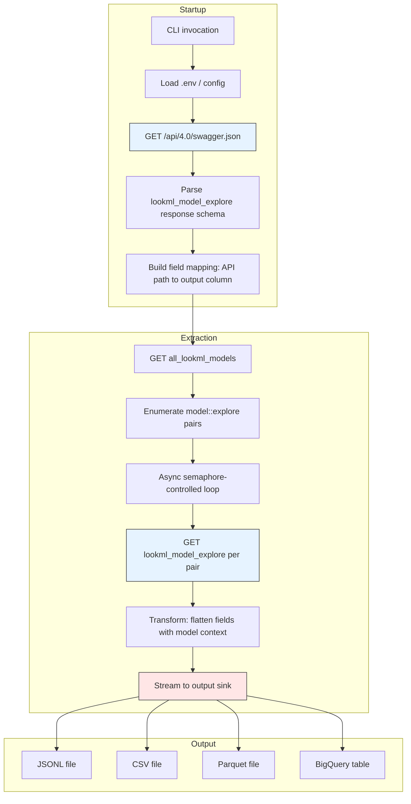

# Architecture — looker-fields-extraction

## Tech Stack

| Component | Library | Why |
|-----------|---------|-----|
| **Runtime** | Python 3.11+ | Modern asyncio, tomllib, type hints |
| **HTTP/async** | `httpx` | HTTP/2, native async, connection pooling — faster than aiohttp |
| **Rate limiting** | `asyncio.Semaphore` + token bucket | Built-in, no external deps |
| **Data models** | `pydantic` v2 | Rust-powered validation, strict typing, schema export |
| **CLI** | `typer` | Auto-generated help, supports --sync flag naturally |
| **JSON (fast)** | `orjson` | 3-10x faster than stdlib json at GB scale |
| **Tabular output** | `pyarrow` | Parquet/CSV write, zero-copy, DuckDB-native |
| **BQ sink** | `google-cloud-bigquery` | load_table_from_json / Parquet upload |
| **Looker SDK** | `looker_sdk` | Official Python SDK for API access |

## Module Structure

```
src/looker_fields/
|-- __init__.py          # Package version, exports
|-- cli.py               # typer CLI entry point
|-- config.py            # .env loading, Settings pydantic model
|-- client.py            # Async Looker API client (httpx)
|-- schema.py            # Swagger discovery + pydantic output models
|-- extract.py           # Core extraction logic (model -> explore -> fields)
|-- output.py            # Multi-sink writer (JSONL, CSV, Parquet, BQ)
```

## Data Flow



## Key Design Decisions

### 1. Swagger-First Schema Discovery

The tool fetches `/api/4.0/swagger.json` from the target Looker instance at startup. This serves three purposes:

1. **Health check** — if unreachable, fail fast
2. **Schema mapping** — derive the response shape of `lookml_model_explore` from the spec, not hardcoded paths
3. **Drift detection** — if the API added/removed fields vs. our baseline, warn or error

Our OUTPUT schema is versioned in `docs/FIELD_SPEC.md`. The Swagger fetch validates that the API still supports the fields we expect.

### 2. Streaming Architecture

The old pipeline loaded everything into memory then merged DataFrames. At scale (1000+ explores, 1-8GB JSON), this OOMs.

Our approach:
- Process one `lookml_model_explore` response at a time
- Flatten fields immediately
- Stream rows to the output sink (append to JSONL, buffer for Parquet/BQ)
- Memory footprint stays constant regardless of instance size

### 3. Async with Sync Fallback

```
Default:     asyncio event loop + Semaphore(N) -> N concurrent API calls
--sync:      Simple for loop, one call at a time -> easy debugging
```

The --sync flag is critical for DX — when something breaks, strip away concurrency to isolate the issue.

### 4. Output Grain

**One row per `(project, model_name, explore_name, field_name)`**

This is THE fix. The client's broken pipeline had `(project, explore_name)` as the merge key — non-unique when an explore appears in multiple models. By including `model_name` in the grain, duplication is impossible by construction.

### 5. Multi-Sink Output

| Sink | Flag | Use Case |
|------|------|----------|
| JSONL | `--format jsonl` (default) | Dev, DuckDB queries, streaming |
| CSV | `--format csv` | IDE inspection, Excel, diffing |
| Parquet | `--format parquet` | Columnar analytics, BQ load |
| BigQuery | `--sink bq` | Production deployment |

All sinks implement a common Writer protocol. Adding new sinks (Postgres, S3, etc.) is a one-class addition.

## Entry Points

| What | Where | When to Read |
|------|-------|--------------|
| CLI args, invocation | `cli.py` | Understanding how to run the tool |
| Config, .env loading | `config.py` | Debugging connection issues |
| Swagger fetch, schema models | `schema.py` | Understanding field mapping |
| API client, rate limiting | `client.py` | Debugging API calls, concurrency |
| Field extraction logic | `extract.py` | Core business logic |
| Output formatting | `output.py` | Adding new sinks, debugging output |

---

*Architecture documented at project kickoff. Will evolve as implementation progresses.*
