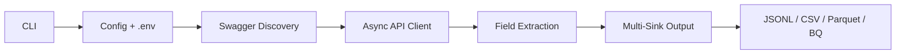

# WORK — looker-fields-extraction

## 1. Current Understanding (Read First)

<current_mode>
building
</current_mode>

<active_task>
TASK-005: Schema verification — Diff our API-extracted schema against the legacy lkml-parser output to prove correctness and find the duplication bugs.
</active_task>

<parked_tasks>
- TASK-003: BigQuery sink — Writer implemented, not wired to CLI yet
- TASK-004: CLI polish — `verify` command, `--sync` mode, progress bar, `--exclude-empty`
- TASK-005: Schema verification — Diff API output vs legacy lkml-parser output (NEXT SESSION)
- TASK-006: Tests — flatten_field, flatten_explore, output writers
</parked_tasks>

<vision>
Open-source Python CLI that extracts field-level metadata from any Looker instance via the API. Swagger-first schema discovery, async extraction with sync fallback, multi-format output (JSONL/CSV/Parquet/BQ). Built for agent-driven development — docs define the autonomous verify-fix loop.
</vision>

<decisions>
- DECISION-001: Python 3.11+ with httpx, pydantic v2, typer, orjson, pyarrow — best-in-class performance libs
- DECISION-002: Swagger-first schema discovery — fetch /api/4.0/swagger.json at startup, derive field mappings dynamically
- DECISION-003: Output grain is (project, model_name, explore_name, field_name) — unique by construction, eliminates the duplication bug
- DECISION-004: Multi-sink from day one — JSONL (default), CSV, Parquet, BQ as first-class citizen
- DECISION-005: Agent dev loop is a first-class project feature — docs/ dir contains machine-readable guidance for autonomous development
- DECISION-006: V1 scope = field-level extraction only. Nail it. Expand later.
- DECISION-007: Seen-in enrichment is default — groups by field_name, computes cross-model/explore visibility. Schema v1.1.0.
- DECISION-008: TASK-001 and TASK-002 complete — MVP extracts 12,429 fields in 16s with 0 dupes. JSONL/CSV/Parquet verified.
</decisions>

<blockers>
None — green field, own instance, full API access.
</blockers>

<next_action>
1. TASK-005: Fork session — diff API-extracted schema against legacy lkml-parser output
2. Prove: duplication bug, NULL model attribution, field count mismatches
3. Then: Wire BigQuery sink to CLI (TASK-003)
4. Then: `verify` command, `--sync` mode, progress bar (TASK-004)
5. Then: Tests (TASK-006)
</next_action>

---

## 2. Key Events Index (Project Foundation)

| Log ID | Type | Task | Summary |
|--------|------|------|---------|
| LOG-000 | VISION | TASK-001 | Project kickoff — open-source Looker field extractor, born from client pipeline analysis |
| LOG-001 | DISCOVERY | TASK-001 | API discovery complete — Swagger + live API analysis, FIELD_SPEC v1.0.0 finalized, repo scaffolded |
| LOG-002 | EXEC | TASK-002 | MVP working — full pipeline extracts 12,429 fields in 16s, JSONL/CSV/Parquet verified, 0 dupes |
| LOG-003 | EXEC | TASK-002 | Seen-in enrichment — cross-model/explore visibility computed per field, schema v1.1.0 |

---

## 3. Atomic Session Log (Chronological)

### [LOG-000] - [VISION] - Project kickoff: open-source Looker field extractor - Task: TASK-001
**Timestamp:** 2026-04-04
**Depends On:** None (genesis)

---

#### Why This Project Exists

During a consulting engagement analyzing a client's `looker_repo.py` pipeline (~1500 lines, 20 hub-spoke LookML repos), we discovered a fundamental data integrity failure:

- **Root cause:** The `lkml` Python library cannot resolve `include` statements — it parses raw LookML strings with no concept of how Looker's engine compiles files together
- **Symptom:** When merging locally-parsed explores with API-sourced model-explore mappings, explores appearing in multiple models create Cartesian products
- **Impact (proven with BQ evidence):** 21.5% bad data — 13.79% Cartesian duplication + 7.71% NULL model attribution leading to 25.7M ghost usage events

The only real fix is **API-first extraction** — fetching the compiled truth directly from the Looker API where each `lookml_model_explore(model, explore)` call returns the fully-resolved state for that specific model.

We proposed this as a 75-hour engagement to the client (Proposal C). Client is stalling on approval. Decision: build it ourselves, open-source, against our own Looker instance (`joonpartner.cloud.looker.com`).

#### Key Decisions Made at Kickoff

| Decision | Choice | Rationale |
|----------|--------|-----------|
| Language | Python 3.11+ | Team maintainability, ecosystem (httpx, pydantic, pyarrow) |
| Schema approach | Swagger-first | Fetch `/api/4.0/swagger.json` at runtime, derive mappings dynamically, detect drift across API versions |
| Output grain | `(project, model_name, explore_name, field_name)` | Unique by construction — eliminates the duplication bug the client pipeline suffers from |
| Output formats | JSONL, CSV, Parquet, BQ | JSONL for dev (DuckDB-ui queryable), CSV for IDE, Parquet for analytics, BQ for production |
| V1 scope | Field-level extraction only | Nail the core problem first. Dashboard lineage, usage joins come later |
| Dev model | Agent-driven loop | `docs/` defines the autonomous cycle: implement, verify against live API, fix, repeat |

#### Architecture Snapshot



**Modules:** `cli.py` -> `config.py` -> `schema.py` -> `client.py` -> `extract.py` -> `output.py`

#### What We Have

- Blank repo at `/home/ubuntu/dev/looker-fields-extraction` with `.env` (admin creds for `joonpartner.cloud.looker.com`)
- Live Looker MCP tools (`execute_sdk_code`, `retrieve_sdk_methods`, `describe_sdk_method`) for real-time API access
- 75-hour proposal document as implementation blueprint
- Full analysis of the client's broken pipeline (13 investigation logs) as domain knowledge

#### Reference: The 75-Hour Proposal (Blueprint)

The proposal sent to the client breaks into four phases. We are adapting this for our open-source build:

| Phase | Proposal Hours | Our Adaptation |
|-------|---------------|----------------|
| 1. Discovery and design | 12 hrs | TASK-001: API discovery + FIELD_SPEC — we have live MCP access, should be faster |
| 2. Core development | 42 hrs | TASK-002 + TASK-003 + TASK-004: extraction, output, CLI |
| 3. QA and rollout | 16 hrs | Agent verify-fix loop replaces manual QA |
| 4. Decommissioning | 5 hrs | N/A — no legacy system to retire |

#### What is Next

| Step | Action | Unblocks |
|------|--------|----------|
| 1 | Scaffold repo (pyproject.toml, src/, docs/, tests/) | Development environment |
| 2 | Fetch Swagger from joonpartner instance | Schema mapping |
| 3 | Inspect `lookml_model_explore` response shape | FIELD_SPEC.md baseline |
| 4 | Write FIELD_SPEC.md | Extraction logic contract |
| 5 | Implement extraction module | Core tool functionality |

---

STATELESS HANDOFF
**Dependency chain:** LOG-000 (genesis)
**What was decided:** Build open-source Looker field extractor. Python, Swagger-first, async, multi-sink. V1 = field-level extraction. Agent-driven dev loop.
**Next action:** Scaffold repo structure, then fetch Swagger spec from joonpartner.cloud.looker.com to begin API discovery (TASK-001).
**If pivoting:** This is a clean-room project. No dependency on client codebase. Start fresh from this log.

---

### [LOG-001] - [DISCOVERY] [EXEC] - API discovery + repo scaffold complete - Task: TASK-001
**Timestamp:** 2026-04-04
**Depends On:** LOG-000 (project kickoff, design decisions)

---

#### Part 1: Repo Scaffold

Created the full project skeleton per ARCHITECTURE.md:

```
looker-fields-extraction/
├── pyproject.toml              # hatchling build, Python 3.11+, all deps
├── .gitignore                  # Python + .env + output files
├── README.md                   # Install, setup, usage, architecture
├── looker_40_openapi.json      # Reference Swagger spec (pre-existing)
├── src/looker_fields/
│   ├── __init__.py             # v0.1.0
│   ├── cli.py                  # typer app: extract, verify, info commands
│   ├── config.py               # pydantic-settings, .env loading
│   ├── client.py               # Async httpx client with auth + semaphore
│   ├── schema.py               # FieldRecord pydantic model (output contract)
│   ├── extract.py              # flatten_field, flatten_explore, extract_all
│   └── output.py               # Writer ABC + JSONL, CSV, Parquet, BQ implementations
├── docs/
│   ├── FIELD_SPEC.md           # ★ Main deliverable — output schema with API evidence
│   ├── AGENT_LOOP.md           # Agent dev cycle: implement → extract → verify → fix
│   ├── VERIFICATION.md         # How to verify output against live API
│   └── DEV_GUIDE.md            # Setup, run, contribute
├── tests/
│   └── __init__.py
└── gsd-lite/                   # (pre-existing)
```

All source modules have real skeleton code with correct imports, type hints, docstrings, and TODO markers. Not just empty files — the extraction logic (`flatten_field`, `flatten_explore`, `extract_all`) is already implemented based on the API analysis below.

#### Part 2: API Discovery — Instance Scale

Called `sdk.all_lookml_models({fields: 'name,project_name,label,explores', exclude_empty: true})` against `joonpartner.cloud.looker.com`.

**Key findings:**
- **~80 total models** on the instance (many are empty marketplace/extension models)
- **~27 models with 1+ explores** containing real fields
- **~139 total explores** across all models
- **Field counts range wildly:** 11 fields (dvd_rental::film) to 2,340 (cortex_sap_operational::sales_orders)

**Largest models by explore count:**

| Model | Project | Explores | Notes |
|-------|---------|----------|-------|
| `fivetran_joon_4_joon` | joon_4_joon | 16 | Internal business data |
| `dvd_rental` | dvd_rental | 15 | Demo/training |
| `cortex_sap_operational` | marketplace_cortex_sap | 14 | Enterprise SAP, massive fields |
| `ga4` | marketplace_ga4 | 14 | Google Analytics |
| `thelook_partner` | looker_partner_demo | 13 | E-commerce demo |

#### Part 3: API Discovery — Response Shape Analysis

Called `sdk.lookml_model_explore()` for 3 sample explores of varying complexity:

##### Sample A: dvd_rental::film (simple, no joins)

```json
{"name": "film", "model_name": "dvd_rental", "project_name": "dvd_rental",
 "view_name": "film", "connection_name": "joon-sandbox",
 "field_counts": {"dimensions": 8, "measures": 3, "filters": 0, "parameters": 0}}
```

Evidence — sample dimension with SQL:
```json
{"name": "film.film_id", "type": "number", "category": "dimension",
 "primary_key": true, "view": "film", "original_view": "film",
 "sql": "${TABLE}.film_id", "source_file": "views/film.view.lkml"}
```

Evidence — measure with null sql (count type):
```json
{"name": "film.count", "type": "count", "category": "measure",
 "sql": null, "view": "film", "source_file": "views/film.view.lkml"}
```

##### Sample B: thelook_partner::order_items (176 dims, 55 measures, 8 joins)

Key observation — **dimension group member** (no separate array!):
```json
{"name": "discounts.date_date", "type": "date_date", "category": "dimension",
 "dimension_group": "discounts.date", "is_timeframe": true,
 "time_interval": {"name": "day", "count": 1},
 "view": "discounts", "original_view": "discounts",
 "source_file_path": "looker_partner_demo/views/discounts.view.lkml",
 "sql": "${TABLE}.date", "times_used": 33}
```

Key observation — **turtle measures** (Looker internal visualization fields):
```json
{"name": "turtle::high_value_geos", "type": "turtle_look",
 "category": "measure", "view": "", "view_label": "",
 "original_view": "order_items", "source_file": "", "times_used": 0}
```
These have empty `view` and `source_file` — our extraction includes them but they're identifiable by the `turtle::` prefix and empty view.

##### Sample C: cortex_sap_operational::sales_orders (2242 dims, 97 measures, 1 param)

Key observation — **parameter field**:
```json
{"name": "sales_orders.Currency_Required", "type": "string",
 "category": "parameter", "view": "sales_orders"}
```

Key observation — `access_filters`, `always_filter`, `conditionally_filter` all returned as empty arrays (not null). Our output doesn't include these explore-level filter configs in V1.

#### Part 4: Swagger vs Reality

Analyzed `looker_40_openapi.json` (reference Swagger spec in repo) alongside live API responses.

**Fields in reality NOT in Swagger:** `synonyms`, `lookml_expression`, `datatype`, `convert_tz`
**Fields in Swagger confirmed in reality:** All major fields verified present
**Dimension groups:** Confirmed NOT a separate array — group members are individual dimensions with `dimension_group` property set

#### Part 5: FIELD_SPEC v1.0.0

Finalized `docs/FIELD_SPEC.md` with:
- 35 output columns mapped to exact API source fields
- Evidence from 3 real API responses
- Conscious exclusions list (17 API fields excluded with rationale)
- Swagger vs Reality comparison table
- Versioning policy

The output grain `(project_name, model_name, explore_name, field_name)` is confirmed unique by construction — the API returns fields scoped to a specific model::explore pair.

#### Decisions Made

| Decision | Choice | Rationale |
|----------|--------|-----------|
| Include turtle measures | Yes, don't filter | User may want to see them; identifiable by empty view |
| Use field-level project_name | Yes, with explore fallback | Some fields (turtle) have null project_name |
| Denormalize explore metadata | Yes, 6 columns | Enables flat-file querying without joins |
| Exclude drill_fields, enumerations | V2 scope | Complex nested structures, rarely needed for field inventory |
| Include times_used | Yes | High value for dead field detection — the original use case |

---

📦 STATELESS HANDOFF
**Dependency chain:** LOG-001 ← LOG-000
**What was decided:** FIELD_SPEC v1.0.0 finalized with 35 output columns. Repo fully scaffolded with real skeleton code. API shape confirmed across 3 sample explores of varying complexity (11 to 2,340 fields).
**Next action:** TASK-002 — Wire up the CLI → config → client → extract → output pipeline. Start with dvd_rental::film (11 fields) as the smoke test. The extraction logic in `extract.py` is already written from API analysis — need to connect it to real HTTP calls.
**If pivoting:** FIELD_SPEC.md is the contract. Any extraction code must produce FieldRecord objects matching that spec. Start from `schema.py:FieldRecord` and `extract.py:flatten_field`.

---

### [LOG-002] - [EXEC] [BREAKTHROUGH] - MVP pipeline working end-to-end - Task: TASK-002
**Timestamp:** 2026-04-04
**Depends On:** LOG-001 (API discovery, FIELD_SPEC, repo scaffold)

---

#### What Was Done

Wired the full extraction pipeline: CLI → config → client → extract → output. Every module is now connected and producing real output against live Looker API.

**Key implementation details:**

1. **Config fix:** `api_url` property now omits `:443` for cloud instances. Trailing `/` ensures correct httpx relative path resolution.
2. **Client paths:** Changed all API paths from absolute (`/login`) to relative (`login`) — httpx resolves relative paths against `base_url`, absolute paths against the host root.
3. **CLI wiring:** `extract` command loads settings → creates async client → streams through `extract_all` → batches to writer (100 records at a time). `info` command shows model/explore counts.
4. **Async extraction:** `asyncio.as_completed` with `Semaphore(10)` — 10 concurrent API calls. 130 explores extracted in ~14s of API time.

#### Test Results

##### Smoke test: dvd_rental::film (11 fields)
```
Total: 11 fields
Categories: {dimension, measure}
8 dimensions + 3 measures
Grain: 11/11 unique (0 dupes)
primary_key correctly identified: film.film_id
```

##### Scale test: thelook_partner::order_items (230 fields, 8 joins)
```
230 fields extracted (176 dims + 54 measures)
Joined views: discounts, inventory_items, users, products, etc.
Dimension groups correctly captured with dimension_group property
```

##### Full instance extraction: all 130 explores
```
Total fields: 12,429
  dimension: 10,366
  measure:    1,934
  filter:        71
  parameter:     58

Models: 24 | Explores: 110 | Projects: 23
Grain uniqueness: 12,429/12,429 (0 dupes)
Time: 16 seconds total

Top explores by field count:
  cortex_sap_operational::sales_orders: 2,340
  google_analytics_360_v2::ga_sessions: 647
  felix_the_field_agent::query_metrics: 606
```

20 explores returned 404 (broken/deleted projects on the instance). Error handling worked correctly — logged and continued without crashing.

##### Format verification
| Format | Test | Result |
|--------|------|--------|
| JSONL | dvd_rental::film + full instance | ✅ Valid JSON per line, orjson serialization |
| CSV | dvd_rental (all 15 explores) | ✅ 365 fields, correct headers |
| Parquet | dvd_rental::film | ✅ 11 rows, 41 columns, correct schema |

#### What's Working (MVP Feature Matrix)

| Feature | Status | Notes |
|---------|--------|-------|
| `looker-fields extract` | ✅ | Full async pipeline |
| `looker-fields info` | ✅ | Shows models, explores, counts |
| `--model` / `--explore` filters | ✅ | Tested with single + multi |
| `--format jsonl` | ✅ | Default, orjson, streaming |
| `--format csv` | ✅ | DictWriter, correct headers |
| `--format parquet` | ✅ | PyArrow, correct schema |
| `--concurrency` | ✅ | Semaphore-controlled |
| `.env` config | ✅ | pydantic-settings, auto-loaded |
| Error handling | ✅ | 404s logged, extraction continues |
| Auth lifecycle | ✅ | Login + logout via context manager |
| Grain uniqueness | ✅ | 12,429/12,429 unique |
| `--verbose` logging | ✅ | Shows all HTTP requests |

| Feature | Status | Notes |
|---------|--------|-------|
| `looker-fields verify` | ❌ | Stub only |
| `--sync` mode | ❌ | Stub only |
| `--sink bq` | ❌ | Writer implemented, not wired to CLI |
| Swagger drift detection | ❌ | Stub only |
| Progress bar | ❌ | Not yet |

#### Dependencies Installed

Used `uv` (v0.8.0) for package management:
```
python 3.13.5, pydantic 2.12.5, pydantic-settings 2.13.1
httpx (with http2), typer 0.24.1, orjson, pyarrow
pytest 9.0.2, ruff 0.15.9
```

---

📦 STATELESS HANDOFF
**Dependency chain:** LOG-002 ← LOG-001 ← LOG-000
**What was decided:** MVP is working. Full extraction pipeline produces 12,429 fields from 130 explores in 16 seconds with zero duplicates. JSONL, CSV, Parquet formats verified.
**Next action:** TASK-003 — Wire BigQuery sink to CLI (`--sink bq`). Then implement `verify` command for automated diff against live API. Then add `--sync` mode, progress bar, and tests.
**If pivoting:** The core pipeline works. `extract.py:flatten_field` and `extract.py:flatten_explore` are the field mapping functions — any schema changes start there. `schema.py:FieldRecord` is the output contract.

---

### [LOG-003] - [EXEC] [BREAKTHROUGH] - Seen-in enrichment: field→model/explore visibility - Task: TASK-002
**Timestamp:** 2026-04-05
**Depends On:** LOG-002 (working pipeline), LOG-001 (FIELD_SPEC)

---

#### What Was Done

Added post-extraction enrichment that computes cross-model/explore visibility for every field. After all records are collected, `enrich_seen_in()` groups by `field_name` and stamps back:
- `seen_in_model_count` — how many models this field appears in
- `seen_in_explore_count` — how many explores
- `total_times_used` — sum of per-explore usage
- `seen_models` / `seen_explores` — explicit lists

**Implementation:** `extract.py:enrich_seen_in()` — two-pass: aggregate into `defaultdict`, then stamp back. CLI now collects all records before writing (was streaming before).

#### Validation Results (Full Instance)

```
12,429 records, 9,025 unique field definitions

Model visibility distribution:
  In 1 model:  8,755 fields (97%)
  In 2 models:    47 fields
  In 3 models:   144 fields
  In 4 models:    50 fields
  In 5 models:    29 fields

270 field definitions (3%) appear across multiple models
```

Cross-model examples:
- `users.id` → 5 models, 14 explores, total_used=312
- `order_items.count` → 5 models (bqml_semantic_search_block, joon_thelook_extended, thelook_ecommerce, thelook_ecommerce_test, thelook_partner), 10 explores
- `users.count` → 5 models, 14 explores, total_used=2,078 (most used field)

Within single model (thelook_partner):
- `users.traffic_source` → 1 model, 9 explores, total_used=1,021
- 292 fields appear in only 1 explore, 10 fields appear in all 9 explores

Schema version bumped to 1.1.0. FIELD_SPEC.md updated with new columns + evidence.

---

📦 STATELESS HANDOFF
**Dependency chain:** LOG-003 ← LOG-002 ← LOG-001 ← LOG-000
**What was decided:** Schema v1.1.0 — 5 new seen-in columns added. Enrichment is default behavior (no flag needed). Groups by `field_name` (fully-qualified view.field).
**Next action:** Remaining work: implement `verify` command, `--sync` mode, wire BigQuery sink to CLI, add tests.
**If pivoting:** The enrichment is in `extract.py:enrich_seen_in`. Grouping key is `field_name`. To change grouping (e.g., by source_file_path), modify the `agg` key.

---
