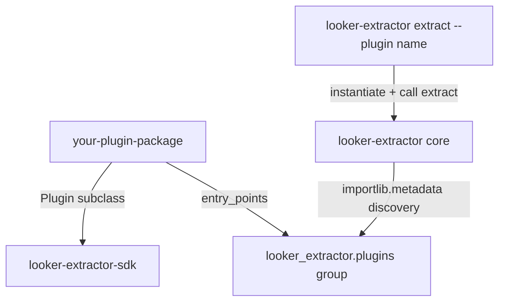

# Plugin Authoring Guide — looker-extractor-sdk

This guide walks you through building a plugin for `looker-extractor` from zero to
published PyPI package, using the `roles` plugin (`looker-extractor-plugin-roles`)
as a worked example throughout.

## Contents

1. [What is a plugin](#what-is-a-plugin)
2. [Quick start (10-line plugin)](#quick-start-10-line-plugin)
3. [Plugin class contract](#plugin-class-contract)
4. [Entry-points registration](#entry-points-registration)
5. [Lineage envelope (`stamp_lineage`)](#lineage-envelope-stamp_lineage)
6. [Swagger seeds + `regen_schema`](#swagger-seeds--regen_schema)
7. [Filters convention](#filters-convention)
8. [Worked example: roles plugin](#worked-example-roles-plugin)
9. [Testing recipes](#testing-recipes)
10. [Roadmap pointers](#roadmap-pointers)

---

## What is a plugin

A plugin is a Python package that:

1. Subclasses `looker_extractor_sdk.Plugin`
2. Implements `async extract(client, *, filters)` — yields one dict per record
3. Registers itself in the `looker_extractor.plugins` entry-points group

At install time, `looker-extractor` discovers the plugin via `importlib.metadata`.
No plugin manifest, no manual import, no edit to core.



## Quick start (10-line plugin)

```python
# my_pkg/plugin.py
from looker_extractor_sdk import Plugin, stamp_lineage

class MyPlugin(Plugin):
    name = "my_plugin"
    version = "0.1.0"
    swagger_seeds = ["MyEntity"]

    async def extract(self, client, *, filters=None):
        for row in await client.get("my_entities"):
            yield stamp_lineage(row, my_entity_id=row["id"])
```

```toml
# my_pkg/pyproject.toml
[project]
name = "looker-extractor-plugin-my-plugin"
version = "0.1.0"
dependencies = ["looker-extractor-sdk>=0.1.0"]

[project.entry-points."looker_extractor.plugins"]
my_plugin = "my_pkg.plugin:MyPlugin"
```

Install both your plugin and `looker-extractor` core into the same env:

```bash
pip install looker-extractor looker-extractor-plugin-my-plugin
looker-extractor plugins list                      # my_plugin now shows up
looker-extractor extract --plugin my_plugin -o out.jsonl
```

## Plugin class contract

```python
class Plugin(ABC):
    name: ClassVar[str] = ""
    version: ClassVar[str] = ""
    description: ClassVar[str] = ""
    swagger_seeds: ClassVar[list[str]] = []

    @abstractmethod
    async def extract(
        self,
        client: Any,
        *,
        filters: dict[str, str] | None = None,
    ) -> AsyncIterator[dict[str, Any]]: ...
```

| Field | Type | Purpose |
|---|---|---|
| `name` | str | CLI identifier (`--plugin <name>`). Must match entry-point key. Snake_case. |
| `version` | str | Plugin's own version (independent of core/SDK). Surfaced by `plugins info`. |
| `description` | str | One-line human description. Surfaced by `plugins list` + `plugins info`. |
| `swagger_seeds` | list[str] | Swagger 2.0 type names the plugin validates against. Drives `regen_schema --plugin <name>`. |
| `extract` | async generator | Yields one `dict` per record. Called once per CLI invocation. |

### What `extract()` receives

- `client` — a `looker_extractor.core.client.LookerClient` instance (typed as `Any` in the
  ABC so the SDK doesn't depend on core). Public methods: `await client.get(path,
  params=None)` for generic GET; typed helpers like `await client.all_lookml_models()`
  for entities core already wraps.
- `filters` — optional dict of free-form key/value strings forwarded from the CLI
  (Phase 2: not yet surfaced on the CLI for arbitrary plugins; supported by the
  contract for direct programmatic use and future CLI extension).

### What `extract()` yields

One dict per record. Conventions:

- Validate the API payload through your plugin's own swagger-generated pydantic type
  before yielding (the **tripwire** — catches API drift at extract time, not at
  warehouse load).
- Yield `model.model_dump()` (preserves nested struct shape; no flattening).
- Stamp a minimal `_extract_<key>` lineage envelope (see next section).

## Entry-points registration

Use the standard Python entry-points group `looker_extractor.plugins`:

```toml
[project.entry-points."looker_extractor.plugins"]
my_plugin = "my_pkg.plugin:MyPlugin"
```

- Key (`my_plugin`) = CLI identifier; must match `Plugin.name`.
- Value (`my_pkg.plugin:MyPlugin`) = `module:ClassName` (NOT instance).
- After install (editable or wheel), `looker-extractor plugins list` discovers it.
- Multiple plugins per package is allowed; multiple packages contributing different
  plugins is the common case.

## Lineage envelope (`stamp_lineage`)

Every row should carry minimal `_extract_*` keys so the downstream warehouse can
join back without inspecting nested structures.

```python
from looker_extractor_sdk import stamp_lineage

row = typed_record.model_dump()
stamp_lineage(row, my_entity_id=str(row["id"]), my_entity_label=row["label"])
# row now has _extract_my_entity_id + _extract_my_entity_label keys
```

Convention: keys are snake_case nouns scoped to your entity (e.g. `_extract_role_id`,
`_extract_role_name` for the roles plugin; `_extract_model_name`,
`_extract_explore_name`, `_extract_field_category` for lookml_fields).

## Swagger seeds + `regen_schema`

`swagger_seeds` is the list of OpenAPI/Swagger type names your plugin validates
against. Transitive `$ref`s are reached automatically.

### How to regenerate types

The shared `scripts/regen_schema.py` in `looker-extractor` core supports a
`--plugin <name>` flag. To add your plugin to the registry:

```python
# packages/looker-extractor/scripts/regen_schema.py
PLUGIN_REGISTRY = {
    ...,
    "my_plugin": {
        "output_dir": ROOT.parent / "my-plugin-package-dir" / "src" / "my_pkg" / "swagger",
        "seeds": ["MyEntity", "MyEntityFoo", "Error", "ValidationError"],
    },
}
```

Then:

```bash
cd packages/looker-extractor
.venv/bin/python scripts/regen_schema.py --plugin my_plugin
```

This writes `swagger/baseline.json` (subset OpenAPI 3 spec) + `swagger/types.py`
(pydantic v2 models, every class patched with `model_config = ConfigDict(extra="allow")`
so undocumented API fields don't trip validation).

### Out-of-tree plugins

If your plugin lives outside the `looker-extractor` monorepo, copy `regen_schema.py`
into your own package and adapt the registry; OR pass `--output-dir <path>` to override
the registry default.

## Filters convention

`filters` is a free-form `dict[str, str]` forwarded from the CLI (future) or direct
programmatic invocation. Recommended keys per entity type:

| Pattern | Example | Notes |
|---|---|---|
| Single-id filter | `filters={"id": "42"}` | Match exact record |
| Multi-id filter | `filters={"ids": "1,2,3"}` | Comma-separated; many Looker endpoints accept this |
| Name filter | `filters={"name": "Admin"}` | Match by entity's name field |
| Field projection | `filters={"fields": "id,name,permissions"}` | Limit returned columns (most Looker GETs honor `fields=` param) |

Unknown keys: ignore (don't raise). The contract is permissive so the CLI can
forward arbitrary `--filter key=value` (Phase 3+) without each plugin breaking.

## Worked example: roles plugin

The complete plugin lives in `packages/looker-extractor-plugin-roles/`. Highlights:

```python
# packages/looker-extractor-plugin-roles/src/looker_extractor_plugin_roles/plugin.py
from looker_extractor_sdk import Plugin, stamp_lineage
from .swagger.types import Role

class RolesPlugin(Plugin):
    name = "roles"
    version = "0.1.0a0"
    description = "One row per Looker role; passthru shape from /api/4.0/roles ..."
    swagger_seeds = ["Role", "PermissionSet", "ModelSet", "Error", "ValidationError"]

    async def extract(self, client, *, filters=None):
        params = {}
        if filters:
            if "ids" in filters: params["ids"] = filters["ids"]
            if "fields" in filters: params["fields"] = filters["fields"]
        raw_roles = await client.get("roles", params=params or None)
        for raw in raw_roles:
            typed = Role.model_validate(raw)
            row = typed.model_dump()
            stamp_lineage(
                row,
                role_id=str(typed.id) if typed.id is not None else None,
                role_name=typed.name,
            )
            yield row
```

### Why this is small

- The Looker `/api/4.0/roles` endpoint is one of the simplest: single GET, no
  pagination, nested struct (`permission_set` + `model_set`) preserved as-is.
- The plugin owns its swagger types (5 seeds + transitive refs); core doesn't know
  about them.
- Total: plugin.py 60 LOC, swagger/types.py 80 LOC (generated), tests 75 LOC.

### Smoke output (one row)

```jsonc
{
  "id": "2",
  "name": "Admin",
  "permission_set": { "id": "1", "name": "Admin", "permissions": ["administer"], ... },
  "model_set": { "id": "1", "name": "All", "models": ["thelook", ...], ... },
  "internal": false,
  "url": "https://example/api/4.0/roles/2",
  "users_url": "https://example/api/4.0/roles/2/users",
  "_extract_role_id": "2",
  "_extract_role_name": "Admin"
}
```

## Testing recipes

### 1. Importability + contract conformance

```python
from looker_extractor_sdk import Plugin

def test_my_plugin_subclasses_sdk():
    from my_pkg.plugin import MyPlugin
    assert issubclass(MyPlugin, Plugin)
```

### 2. Class attribute fingerprint

```python
def test_my_plugin_attrs():
    from my_pkg.plugin import MyPlugin
    assert MyPlugin.name == "my_plugin"
    assert MyPlugin.version == "0.1.0"
    assert "MyEntity" in MyPlugin.swagger_seeds
```

### 3. Entry-points discoverability

```python
def test_my_plugin_entry_point_fires():
    from importlib.metadata import entry_points
    eps = entry_points(group="looker_extractor.plugins")
    assert "my_plugin" in {ep.name for ep in eps}
```

### 4. Extract() smoke against a fake client

```python
import pytest

@pytest.mark.asyncio
async def test_extract_smoke():
    class FakeClient:
        async def get(self, path, params=None):
            return [{"id": "1", "name": "foo"}]
    plugin = MyPlugin()
    rows = [r async for r in plugin.extract(FakeClient())]
    assert rows[0]["_extract_my_entity_id"] == "1"
```

Real `LookerClient` is async-context-manager (`async with LookerClient(settings)`),
but for unit tests a duck-typed fake with `.get(path, params=None)` is enough — the
Plugin ABC types `client` as `Any`.

## Roadmap pointers

- **Phase 3** (queued): `looker-extractor plugins init` Copier scaffold —
  `lx plugins init my_plugin` will generate the package skeleton above.
- **Phase 4**: in-tree plugins for `users`, `looks`, `scheduled_plans`, `folders`,
  `user_attributes` (priority order per LOG-020). Each ships as separate `looker-extractor-plugin-*` PyPI package.
- **Phase 5**: Plugin Hub JSON index + `lx plugins search`/`install` discovery commands.
- **Phase 6**: `uvx looker-extractor extract --plugin <pypi-name>` sandbox (zero-install).
- **Phase 7**: YAML-only plugin manifests for trivial passthru cases (no Python required).
- **Phase 8**: conformance harness as a separate `looker-extractor-tests-plugin` package
  so third-party plugins can self-certify against the contract.

For questions or RFCs, open an issue at
<https://github.com/luutuankiet/looker-extractor/issues>.
