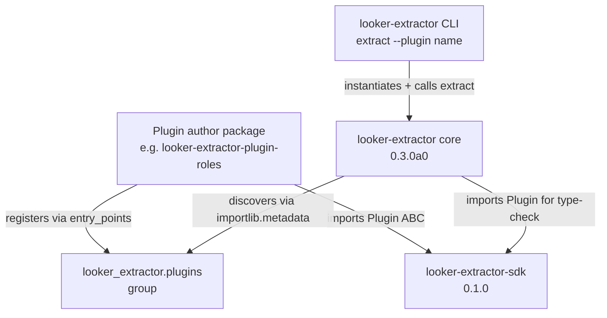

# looker-extractor-sdk v0.1.0 — Plugin SDK extracts from core

**Released:** 2026-05-23

---

## TL;DR

The Plugin SDK ships as a standalone PyPI package, separate from `looker-extractor` core.

Plugin authors no longer pull the full extractor dependency tree (httpx, looker-sdk, typer, pyarrow, ...) just to declare a Plugin class. The SDK depends only on `pydantic`. Pattern lifted from `dbt-adapters` / `dbt-core`: a stable, slim contract package, separate from the engine that consumes it.

```bash
pip install looker-extractor-sdk
```

```python
from looker_extractor_sdk import Plugin, stamp_lineage

class MyPlugin(Plugin):
    name = "my_plugin"
    version = "0.1.0"
    swagger_seeds = ["MyEntity"]

    async def extract(self, client, *, filters=None):
        for row in await client.get("my_entities"):
            yield stamp_lineage(row, my_entity_id=row["id"])
```

Register via standard Python entry-points and `looker-extractor` discovers the plugin at install time — no plugin manifest, no manual import.

## Why

Through Phase 1 of the plugin platform conversion, the SDK lived inside the core repository as a workspace member (`packages/looker-extractor-sdk`). Versions tracked core 1:1 (`0.1.0a0` alongside core `0.3.0a0`).

This release decouples them. The SDK now has its own:

- PyPI publish cadence (tag pattern: `sdk-v*`)
- Release notes file (this one — `releases/sdk-v*.md`)
- Version line (starts at `0.1.0`)

That means third-party plugin authors can pin against a stable SDK contract while core iterates fast on extraction internals.

## Highlights

| Surface | What it is | Why it matters |
|---|---|---|
| `Plugin` ABC | Abstract base for plugin classes — `name`, `version`, `swagger_seeds` ClassVars + async `extract(client, *, filters)` | The entire contract. Three class attributes + one async generator. |
| `stamp_lineage(record, **kwargs)` | Writes `_extract_<key>` keys into a record dict (in-place + returned) | One-liner so plugins don't reinvent the lineage envelope convention. |
| `looker_extractor.plugins` entry-points group | Plugins register via standard Python entry-points | Discovery is `importlib.metadata.entry_points`; no manifest, no import dance. |

## Architecture



The SDK sits below both authors and core. Authors target the SDK; core discovers + invokes through it.

## Worked example (full reference)

The `lookml_fields` plugin in core is a complete reference implementation:

- Subclasses `Plugin` with `swagger_seeds = [12 LookmlModel* types]`
- Validates API responses through plugin-owned swagger-generated pydantic types (the tripwire)
- Yields one row per field with `_extract_model_name` / `_extract_explore_name` / `_extract_field_category` lineage

A more digestible second example — the `roles` plugin (≥90 LOC including tests) — ships in `looker-extractor-plugin-roles` and is the worked example in `AUTHORING.md` (queued for `sdk-v0.1.1`).

## Before / After

**Before** — plugin authors had no published contract:

    # Implicit, undocumented:
    from looker_fields.???  # what do I import?
    # (no entry-points group, no ABC, no separation)

**After** — published SDK with stable surface:

    pip install looker-extractor-sdk
    # then in pyproject.toml:
    [project.entry-points."looker_extractor.plugins"]
    my_plugin = "my_pkg.plugin:MyPlugin"

## Installation

```bash
pip install looker-extractor-sdk
```

For plugin authoring, you'll also want core installed in a dev env (to test discovery):

```bash
pip install looker-extractor
```

## Compatibility

- Python ≥ 3.11
- pydantic ≥ 2.0

Core/SDK version skew is non-blocking through the `0.x` line: as long as the `Plugin` ABC + `stamp_lineage` shapes are stable, core can iterate independently. `v1.0` locks the ABC.

## Files in the wheel

- `looker_extractor_sdk/__init__.py` — package init, exports `Plugin` + `stamp_lineage`
- `looker_extractor_sdk/plugin.py` — Plugin ABC + stamp_lineage helper
- `AUTHORING.md` — plugin authoring guide (10 sections: contract, quick start, entry-points, lineage envelope, swagger seeds, filters convention, worked example, testing recipes, roadmap)
- `README.md` — package overview + link to AUTHORING

Code: ~50 LOC. Docs: ~300 LOC. The SDK is a contract, not an engine.

## Companion ship: looker-extractor-plugin-roles

Ships alongside as the first third-party plugin proof and the worked example referenced in AUTHORING.md:

- One row per Looker role from `GET /api/4.0/roles` (single call, no pagination)
- Nested `permission_set` + `model_set` structs preserved as passthru
- Tripwire validation through plugin-owned swagger-generated pydantic types
- 60 LOC plugin.py + 80 LOC swagger/types.py (generated) + 75 LOC tests/test_conformance.py

```bash
pip install looker-extractor-plugin-roles
looker-extractor extract --plugin roles -o roles.jsonl
```

## What's next

- **Phase 3**: `lx plugins init my_plugin` Copier scaffold — zero hand-typing of package boilerplate.
- **Phase 4**: ship the priority-2 plugins (`users`, `looks`, `scheduled_plans`, `folders`, `user_attributes`) as separate `looker-extractor-plugin-*` PyPI packages.
- **Phase 5+**: Plugin Hub JSON index, `uvx` sandbox, YAML-only manifests, conformance harness package.
