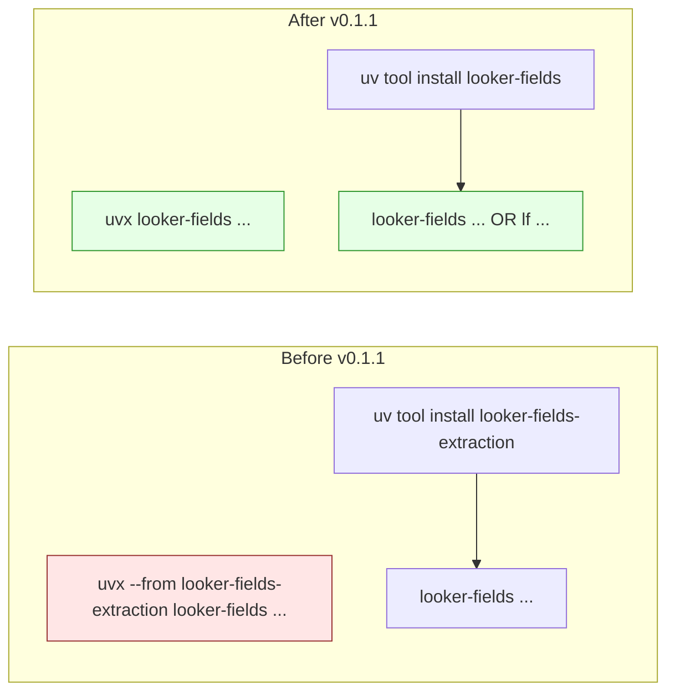

# v0.1.1 — Rename to `looker-fields` + `lf` short alias

## TL;DR

The PyPI distribution is now `looker-fields` (was `looker-fields-extraction`). A new short alias `lf` ships alongside `looker-fields` for terser daily typing. The Python import path is unchanged — `import looker_fields` still works as before.

## Why

A daily-use CLI tool deserves daily-use ergonomics. The original distribution name forced users into:

```bash
uvx --from looker-fields-extraction looker-fields ...
```

because `uvx` expects the distribution name and the script name to match when invoking one-shot. Renaming fixes that at the root; the long name was never load-bearing.

## Highlights

| Change | Before | After |
|---|---|---|
| PyPI distribution name | `looker-fields-extraction` | `looker-fields` |
| Primary command | `looker-fields ...` | `looker-fields ...` (unchanged) |
| Short alias | n/a | `lf ...` |
| Python import | `import looker_fields` | `import looker_fields` (unchanged) |
| Old distribution on PyPI | 0.1.0 | tombstoned at 0.1.0; deprecation banner points here |

## Invocation, before vs after



### One-shot run (no install)

```bash
# Before
uvx --from looker-fields-extraction looker-fields info

# After
uvx looker-fields info
```

### Daily use (recommended)

```bash
# Install once globally
uv tool install looker-fields

# Then use from anywhere
looker-fields extract --model my_model --output fields.jsonl
lf info
lf verify my_model my_explore --output fields.jsonl
```

## Upgrade Notes

### If you installed `looker-fields-extraction` already

```bash
# Uninstall the old name
uv tool uninstall looker-fields-extraction      # or pipx uninstall looker-fields-extraction

# Install the new name
uv tool install looker-fields
```

Your `import looker_fields` lines do not change. Your `.env` does not change. Your stored extraction outputs do not change. Only the *distribution name on PyPI* changed.

### If you pin in requirements / pyproject

```diff
- looker-fields-extraction>=0.1.0
+ looker-fields>=0.1.1
```

### If you stay on the old name

`looker-fields-extraction==0.1.0` remains installable indefinitely. No new releases will land there — it is the final tombstone version. Migrate at your convenience.

## Files Changed

| File | Change |
|---|---|
| `pyproject.toml` | `name` field; new `[project.scripts]` entry `lf` |

---

*Companion to the architecture pivot in progress — see `gsd-lite/PROJECT.md` for the manifest-native framework direction landing in subsequent 0.1.x releases.*
