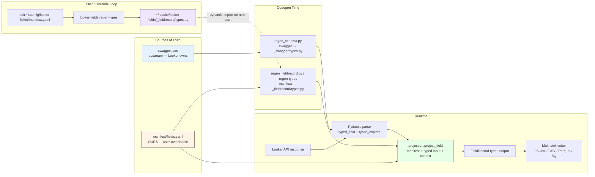

# v0.2.0 — Manifest-native architecture: edit YAML, not Python

## TL;DR

The output schema is now declarative. `manifest/fields.yaml` is the single source of truth for what columns the extractor produces; the runtime, the typed Python models, and the drift detectors all flow from it. Adding a column is a YAML edit. Overriding the contract is a YAML file you drop in `~/.config/looker-fields/`. Two new commands (`refresh-manifest`, `regen-types`) close the plug-and-play override loop.

## Why

The 0.1.x extractor had the output schema hand-coded in Python:

- `extract.flatten_field` — 62 lines of `field.get("X", default)` calls then a `FieldRecord(...)` constructor
- `schema.FieldRecord` — 226-line pydantic class hand-rolled, every column listed inline
- Adding a column meant editing four files; renaming meant five. Two were named `schema.py`. The drift detector silently accepted manifests referencing nonexistent swagger paths.

This is the tax every metadata-extraction tool charges. Customers either eat it or fork the project to add their own columns and never upstream the fork.

v0.2.0 inverts the relationship. The manifest is the contract; everything else (typed input parsers, typed output records, runtime projection logic, drift detectors) is derived from it. The user owns the contract.

## Highlights

| Change | Before (0.1.1) | After (0.2.0) |
|---|---|---|
| Output schema source of truth | `schema.py::FieldRecord` (hand-rolled, 226 lines) | `manifest/fields.yaml` (39 cols + 7 derived) |
| Adding a column | edit 4 Python files | edit 1 YAML row + regen |
| Runtime mapping logic | `flatten_field` (62 lines of hand-rolled `.get()`) | `projection.project_field` (manifest-driven) |
| Client schema override | fork the repo | edit `~/.config/looker-fields/manifest.yaml` + `regen-types` |
| Drift detection | API spec only | API spec **+** manifest ↔ swagger alignment |
| Plug-and-play CLI | `refresh-schema` | + `refresh-manifest`, `regen-types`, `--manifest-path` |
| Tests | 14 | 36 (including a bundled-pair drift invariant) |
| Model attribution bug | nullable `explore.model_name` from API | extraction-loop iteration variable (never null) |

## Architecture: three-layer codegen surface



The three-`extra`-policy invariant:

| Layer | Module | Pydantic policy | Why |
|---|---|---|---|
| Input | `_swagger/types.py` | `extra="allow"` | forward-compat with Looker API additions |
| Config | `manifest/schema.py` | `extra="allow"` | forward-compat with new manifest sections |
| Output | `_fieldrecord/types.py` | `extra="forbid"` | strict contract for downstream consumers |

## Before vs After

### Adding a column (surface a new `description_brief` field from the API)

```diff
Before (0.1.1):
- Edit src/looker_fields/schema.py — add description_brief: str = Field('', ...) to FieldRecord
- Edit src/looker_fields/extract.py — add description_brief=field.get("description_brief", "") to flatten_field
- Edit docs/FIELD_SPEC.md — add a row to the Output Columns table
- Edit tests where applicable
- Hope nothing else broke

After (0.2.0):
- Edit src/looker_fields/manifest/fields.yaml — add 5 lines:
    - name: description_brief
      type: str
      api_source: field.description_brief
      default: ''
      description: Short description
- Run: python scripts/regen_fieldrecord.py
- Done. The typed FieldRecord, runtime projection, drift detector — all pick it up.
```

### Client-side schema override (no fork required)

```bash
# 1. Drop your custom manifest at the XDG path
cp my_manifest.yaml ~/.config/looker-fields/manifest.yaml

# 2. Regenerate the typed output class to match
looker-fields regen-types
# Wrote /home/you/.cache/looker-fields/_fieldrecord/types.py

# 3. Next program startup dynamic-imports your contract
looker-fields extract
# INFO:looker_fields._fieldrecord:Loaded FieldRecord from XDG cache: ...
```

### Drift detection at both ends

```bash
# After a Looker upgrade
looker-fields refresh-schema
# Pulls fresh swagger; warns on missing required paths (v1)
# AND warns when manifest api_source paths no longer resolve (v2)

# When you want to know what attributes you could add to the manifest
looker-fields refresh-manifest
# Lists swagger attrs your manifest does not reference yet
```

## Upgrade Notes

### Most users: zero code changes

`pip install --upgrade looker-fields`. Done. The import path `from looker_fields.schema import FieldRecord` is unchanged. JSONL output is column-compatible. CLI commands you already use (`extract`, `verify`, `dump`, `info`, `refresh-schema`) work identically.

### If you import `extract.flatten_field` directly

That function is **gone**. It was the hand-rolled body this release deletes. Migration:

```diff
- from looker_fields.extract import flatten_field
- record = flatten_field(raw_field, model_name=m, explore_name=e, project_name=p, explore_meta=meta)

+ from looker_fields.extract import flatten_explore
+ records = flatten_explore(raw_explore_dict, model_name=m)
+ # OR, if you have already-typed inputs and want full control:
+ from looker_fields.projection import project_field, ExtractionContext
+ from looker_fields.manifest import ManifestSpec, load_manifest
+ manifest = ManifestSpec.model_validate(load_manifest())
+ context = ExtractionContext(model_name=m)
+ record = project_field(typed_field, typed_explore, context, manifest)
```

### If you depend on field ordering in JSONL output

Manifest order is now authoritative. Explore-context columns come **before** seen-in-aggregation columns (was the reverse in 0.1.x). If your downstream code is column-order-sensitive — it shouldn't be, JSONL keys are unordered per row — pin a manifest snapshot.

### If you maintain a custom output schema

Welcome to the new world. Stop forking. Edit `~/.config/looker-fields/manifest.yaml` + `looker-fields regen-types`. See the README's "The manifest is your contract" section.

## Files Changed

16 files: 1300 insertions, 319 deletions.

| Path | Change |
|---|---|
| `src/looker_fields/projection.py` | **NEW** — runtime mapper |
| `src/looker_fields/manifest/drift.py` | **NEW** — drift detector v2 + addition suggestions |
| `src/looker_fields/_fieldrecord/codegen.py` | **NEW** — codegen as library (powers `regen-types`) |
| `tests/test_projection.py` | **NEW** — 15 synthetic projection tests |
| `tests/test_manifest_drift.py` | **NEW** — 7 drift tests + bundled-pair invariant |
| `src/looker_fields/_fieldrecord/__init__.py` | rewrite — XDG-aware dynamic loader |
| `src/looker_fields/cli.py` | 5 → 7 commands; `--manifest-path` flag on extract+verify |
| `src/looker_fields/extract.py` | `flatten_field` deleted (62 lines); orchestrator only |
| `src/looker_fields/manifest/__init__.py` | drift exports |
| `src/looker_fields/manifest/fields.yaml` | 1-line fix: `model_name.api_source` → `context.model_name` |
| `src/looker_fields/verify.py` | `diff_extracted_vs_raw` accepts optional manifest |
| `scripts/parse_field_spec_to_manifest.py` | override registry preserves the `model_name` fix across regens |
| `scripts/regen_fieldrecord.py` | thin wrapper around `_fieldrecord.codegen.regenerate` |
| `pyproject.toml` | version 0.1.1 → 0.2.0 |
| `README.md` | rewrite — value-forward positioning |

---

*Roadmap: same manifest-native pattern lands for Models (v0.3), Explores (v0.4), Looks/Dashboards (v0.5+).*
