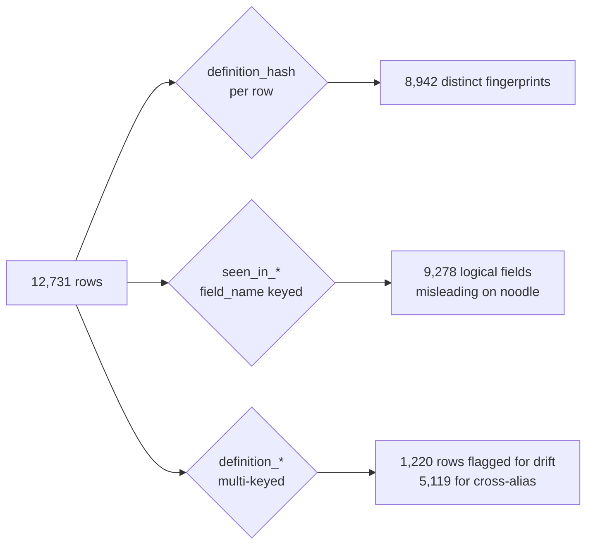

# v0.2.1 — Definition Identity: surface the drift `seen_in_*` hid

**Released:** 2026-05-22

---

## TL;DR

Three new derived columns make refinement-driven drift queryable for the first time: `definition_hash`, `definition_variant_count`, `definition_appearances_count`.

On a real 12,731-record Looker instance we tested against: **9.6% of rows had silent definition drift** that the old `seen_in_*` aggregation was collapsing into a single number. 40.2% had cross-alias semantics `seen_in_*` couldn't surface.

Zero breaking changes. Three additive columns. One DuckDB query:

    SELECT field_name, definition_variant_count
    FROM read_json_auto('extract.jsonl')
    WHERE definition_variant_count > 1;

If you've ever wondered whether your `users.email` is actually the same field across every explore — now you can answer with evidence.

## Why

The v0.2.0 row grain `(project, model, explore, field_name)` is correct — every appearance is preserved 1:1, no rows dropped. But the `seen_in_*` summary columns are keyed by `field_name` alone. When a refinement in `model_B` adds a `pii` tag or replaces the SQL on `users.email`, both `model_A.users.email` and `model_B.users.email` rows stamp `seen_in_explore_count=2` — implying uniform definition.

That was the silent drift. Per-row data (sql, tags, source_file_path) was always preserved correctly; the *aggregation summary* was the lie.

v0.2.1 splits the question into three identity flavors:

| Identity flavor | Tuple | Answers |
|---|---|---|
| **Appearance** | `(project, model, explore, field_name)` | "Where is this field visible in the catalog?" |
| **Definition** | `(original_view, leaf_name)` + content hash | "What LookML actually produced this field?" |
| **Logical** | `field_name` alone | "Is this 'the same field' across the instance?" |

## Highlights

| Column | Type | What it answers |
|---|---|---|
| `definition_hash` | str | sha256 of canonical content tuple — byte-level row fingerprint. Identical hashes = identical definition. |
| `definition_variant_count` | int | Distinct hashes per `field_name` across the instance. `> 1` = refinement-driven drift. |
| `definition_appearances_count` | int | Distinct `(model, explore)` per `(original_view, leaf_name)`. Merges across `from:` aliases that `seen_in_*` keeps separate. |

Bonus closures in the same release:

- **F1 defensive assertion** — `flatten_explore` raises loud if Looker's API ever returns a duplicate `field_name` within one explore (Looker's validator says this can't happen; we defend).
- **`dynamic_fields` excluded from `seen_in_*`** — query-scoped table calculations have no stable identity; correctly zeroed in aggregation now.

## Real-world validation

We ran v0.2.1 against a 12,731-field instance and queried for drift:

    Total rows:           12,731
    Unique grain tuples:  12,731   (100%)
    Rows with drift:       1,220   (9.6%)
    Rows with cross-alias: 5,119   (40.2%)

Top drift cases caught:

- `users.email` — 14 appearances × 3 distinct definitions × 2 tag variants × 6 source files
- `users.first_name` — 14 appearances × 3 definitions × **2 sql variants** (sql actually differs across refinement chains)
- `products.distribution_center_id` — 10 appearances × 3 definitions × 2 sql variants
- `users.last_name` from `kitten_users` vs `users` original_view — cross-project view collision

Top cross-alias views (where `definition_appearances_count` is essential):

- `order_items` — 4 aliases × 278 distinct field_names × 759 appearances
- `user_facts` — 5 aliases × 183 field_names × 217 appearances

## Diagram

## Before / After

**Before v0.2.1** — one query, one answer, no nuance:

    SELECT field_name, seen_in_explore_count
    FROM extract
    ORDER BY seen_in_explore_count DESC;
    -- "users.email appears in 14 explores"
    -- ... but does it mean the same thing in all 14? Silence.

**After v0.2.1** — audit the silence:

    SELECT field_name,
           seen_in_explore_count,
           definition_variant_count,
           definition_appearances_count
    FROM extract
    WHERE definition_variant_count > 1
    ORDER BY definition_variant_count DESC, seen_in_explore_count DESC;

    -- "users.email seen_in 14 explores BUT 3 distinct definitions"
    -- "users.first_name seen_in 14 explores BUT 2 different SQL expressions"
    -- "users.last_name appears under both `users` and `kitten_users` original_views"

## Upgrade

    pip install --upgrade looker-fields
    looker-fields regen-types   # only if you use a custom manifest

If you've never had `definition_*` columns, you don't need to migrate anything — the new columns ship alongside the existing schema. Existing consumers ignore them; new consumers can opt in.

## Limits (honest)

The Looker API does not expose `extends_chain`, `included_via`, `parent_view`, or any refinement-chain attribution. We capture the *composed result* per row; we cannot tell you *which* extension contributed. For full lineage, parse the LookML repo directly. This tool is a catalog, not a lineage extractor.

## Files changed

- `src/looker_fields/manifest/fields.yaml` — +3 derived columns
- `src/looker_fields/extract.py` — F1 grain assertion in `flatten_explore`; `enrich_seen_in` extended with definition_* pass and `dynamic_fields` exclusion; new `_compute_definition_hash` helper
- `src/looker_fields/verify.py` — `NON_DETERMINISTIC_COLUMNS` extended with the 3 new derived columns
- `src/looker_fields/_fieldrecord/types.py` — regenerated (39 direct + 10 derived = 49 cols)
- `tests/test_dedup_correctness.py` — NEW, 8 tests covering F1/F2/F3/F5/F7 patterns
- `docs/FIELD_SPEC.md` — new "Definition Identity" section
- `scripts/parse_field_spec_to_manifest.py` — `_derived_deterministic` recognizes "Hashed" keyword
- `README.md` — "Field Identity Semantics" section + use case rows

## Acknowledgements

This release exists because someone asked: *"how do we make sure our dedup is actually deduping or just naively dropping fields that have critical differences because their inheritance chain is different?"*

Turned out the answer on a real instance was 9.6%. Now it's queryable.
